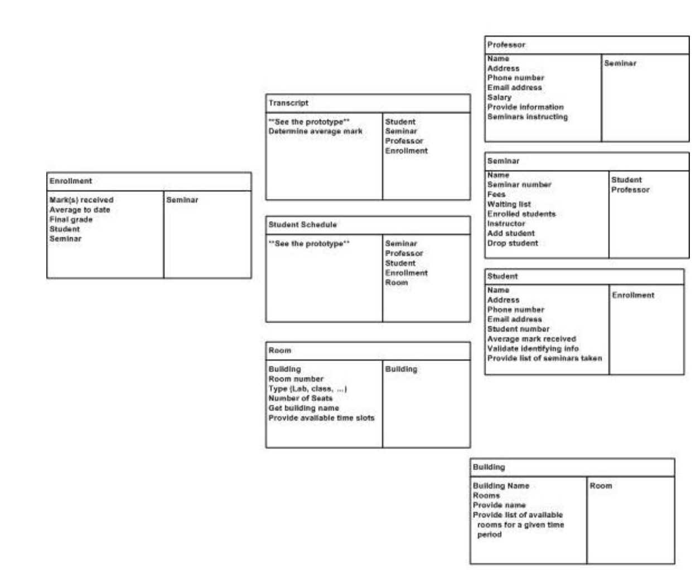

# Object Oriented Programming
## Expressing Requirements
*As a ______, I want to ________ so that ______.*
- blank1 => what is the role of user
- blank2 => goal that the user role  wants to achieve
- blank3 => reason why the user role wants this goal
Example:
As an **Online Shopper** I want to **add** an item to my shopping cart, so that I can **purchase** it.
Verbs help you identify the requirements that your objects might have, also identifies the connections between objects.
For example:
- "add" and "purchase" might be the responsibilities of shopping cart.
- One online shopper is typically linked with one shopping cart.

-------------------------
Noun corresponds to objects in your software. In the above example, I have identified three nouns:
- Online Shopper
- Item
- Shopping Cart

Verbs can help you to identify the requirements that your objects might have. In the above example.
Shopping Cart has the following responsibilities:
- add
- purchase

Verbs can also help to identify the connections between objects. In the above example, the connections can be following:
- One online shopper is typically associated with one shopping cart
- one cart should be caoable of holding multiple items

**NOTE:** User Strories are just one of many techniques that can be used to express requirements for a software system. Advantages:
- Simple to use
- can allow to apply object oriented thinking
- discover objects, requirements and connection

This helps to keep software well structured and more clear

## Categories of Objects in Design
Generally three categories of objects:
- **Entity Objects:**
    
    They correspond to some real-world entity in the problem space. Object representing a chair, building, customer are entity objects.

    These objects will know attributes of themselves, also able to modify themselves, and have some rules to do so.

    While identifying the objects in software, breaking down the objects into smaller objects will get you the entity objects

- **Boundary Objects:**

    These objects sit at the boundary between systems. This could be an object which deals with another software system(like an object that obtains information from the internet) It could also be an object with responsibility of showing information to the user and getting their input.

    Any object that deals with another system - a user, another software system, the internet, can be considered as boundary object
- **Control Objects:**
    
    Control Objects are objects which are responsible for coordination. Contol objects cab be discovered when you attempt to breakdown a large object and find that it would be useful to have an object that controls other objects.

    Example: Mediator, it simply coordinates the activities of many different objects so that they can stay **loosely coupled**

### Competing Qualities
- Performance
- Convenience
- Security

## Qualities:
- Functional Requirements: Describes what the system or application is expected to do.
Software solution should aligned to meet such requirements.

    Example: A media app has a functional requirement to download a full length movie.

    **Key Quality:** Correctness

- Non-Functional Requirements: Specifies how well the system or application does what it does. Such requirements may describe how well the software runs in particular situations.

    Example: Download movie at a specific speed and play the movie within certain memory limit. 

    **Key Quality:** Correctness, Performance, Resource Usage, Efficiency

 

Other Qualities:
- Reusuability
- Flexibility
- Maintainability

### Record, Organize, and Refine Components
**CRC Cards: Class, Responsibility, Collaborator**
helps to oganise components, identify responsibilities and determine how they collaborate

# Components of Object Oriented Programming
## Abstraction
Abstraction is the idea of simplifying a concept in the problem domain to its essentials within some context. Abstraction allows you to better understand a concept by breaking it down into simplified description thet ignores unimportant details.

**Rule of Least Astonishment**

The abstraction captures the essential attributes and behavior for concept with no surprises and no definitions that fall beyond its scope. You don;t want to surprise anyone trying to understand your abstraction with irrelevant characteristics.

**Abstraction in Real Word**

You need to know how to use your coffee machine to make coffee. You need to provide water and coffee beans, switch it on and select the kind of coffee you want to get.

The thing you don’t need to know is how the coffee machine is working internally to brew a fresh cup of delicious coffee. You don’t need to know the ideal temperature of the water or the amount of ground coffee you need to use.

Someone else worried about that and created a coffee machine that now acts as an abstraction and hides all these details. You just interact with a simple interface that doesn’t require any knowledge about the internal implementation.

**Abstraction in OOP**

Objects in an OOP language provide an abstraction that hides the internal implementation details. Similar to the coffee machine in your kitchen, you just need to know which methods of the object are available to call and which input parameters are needed to trigger a specific operation. But you don’t need to understand how this method is implemented and which kinds of actions it has to perform to create the expected result.

### Different Types of Abstraction
**Data Abstraction**

Data abstraction refers to hiding the original data entity via a data structure that can internally work through the hidden data entities. As programmers, we don’t need to know what the underlying entity is, how it looks etc.

Let’s say that I need a special hazelnut coffee this time. Luckily, there’s a new type of coffee powder or processed coffee beans that already have hazelnut in it. So I can directly add the hazelnut coffee beans and the coffee machine treats it as just any other regular coffee bean. In this case, the hazelnut coffee bean itself is an abstraction of the original data, the raw coffee beans. I can use the hazelnut coffee beans directly without worrying about how the original coffee beans were made to add the hazelnut flavour to it.

**Process Abstraction**

In process abstraction, the underlying implementation details of a process are hidden. We work with abstracted processes that under the hood use hidden processes to execute an action.

Let’s say our coffee machine has a function to internally clean the entire empty machine for us. This is a process that we may want to do every once a week or two so that our coffee machine stays clean. We press a button on the machine which sends it a command to internally clean it. Under the hood, there is a lot that will happen now. The coffee machine will need to clean the piston, the outlets or nozzles from which it pours the coffee, and the container for the beans, and then finally rinse out the water and dry out the system.

## Encapsulation
Encapsulation forms a self contained object by bundling the data and functions it requires to work, exposes an interface whereby other objects can access and use it and restrcits access to certain inside details.

In other words,
1. Bundle attribute vaules or data and behaviors or functions that manipulate that data
2. Expose certain data and functions of the objectwhich can be accessed from other objects
3. Restrict access to certain data and functions to only within that object

**Advantages of Encapsulation**
- Loosely coupled code
- Better Access Control and Security